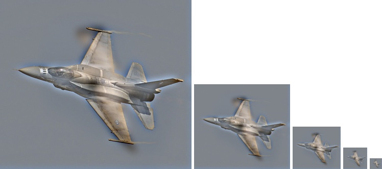
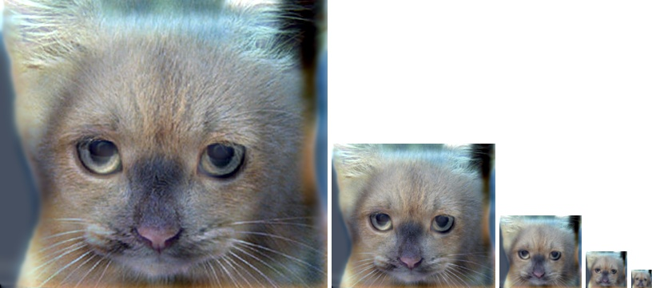
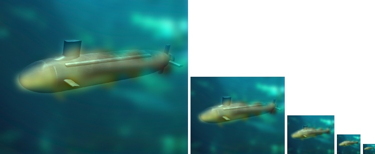
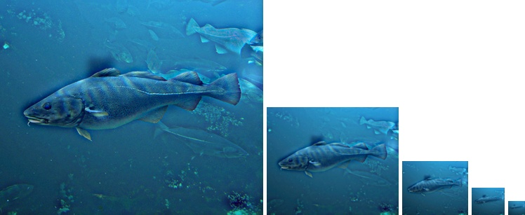

# Your Name <span style="color:red">(yout cs id)</span>

# Project 1 / Image Filtering and Hybrid Images

## Overview
The project is related to 
> hybrid image


## Implementation
1. One
	* item
	* item
2. Two

```
Code highlights
```

## Installation
* Other required packages.
* How to compile from source?

### Results

<table border=1>
<tr>
<td>




</td>
</tr>

<tr>
<td>


</td>
</tr>

</table>
